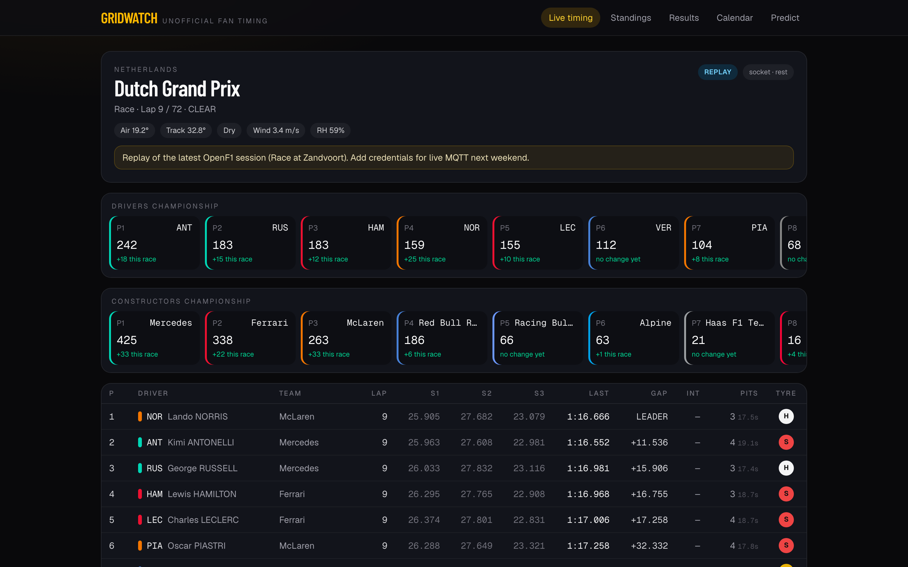
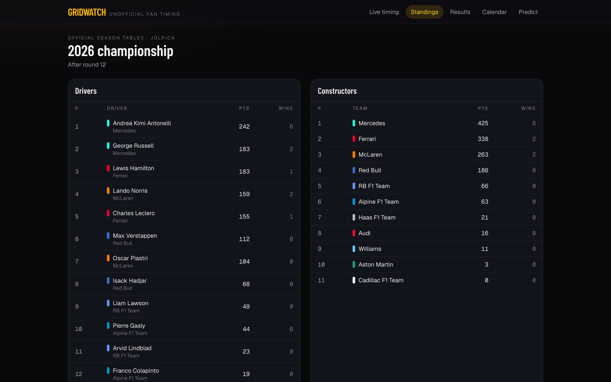
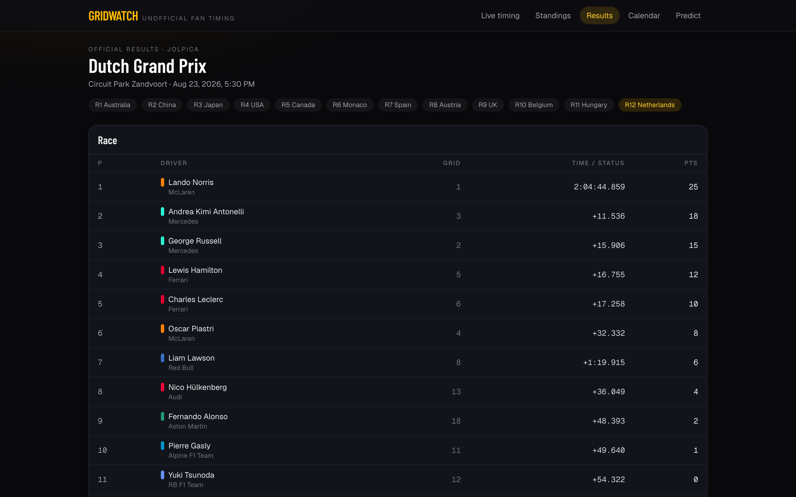
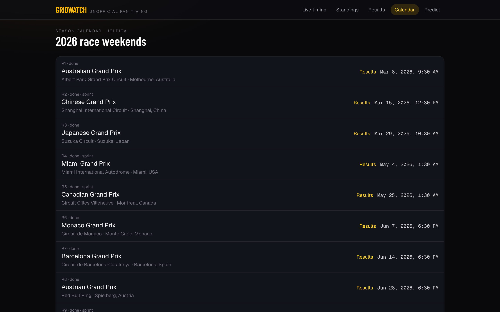
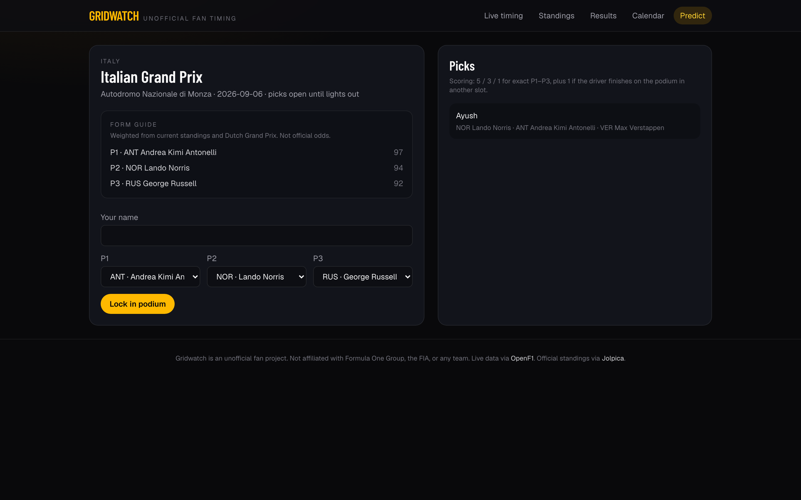

# Gridwatch

Unofficial timing board I put together for race weekends. Positions, gaps, tyres, the championship after the last round, and a simple podium pick with friends.

This is a fan project. Not F1, not the FIA, not a team. No official logos on purpose.



## Pages

**Live timing** — current (or last) session. Gaps, sectors, pit count, weather, race control, and a rough live championship if OpenF1 has one.

**Standings / results / calendar** — the official tables after the session is in the books.

**Predict** — pick a podium before lights out. 5 / 3 / 1 for exact P1–P3, plus a consolation point if you had them on the podium in the wrong slot. There's a form guide too; it's just standings + last race, not some magic model.









## Run it

Needs Node 20+.

```bash
npm install
cp .env.example .env
npm run dev
```

Then open [http://localhost:3000](http://localhost:3000). The site is on `:3000`, a small ingest process is on `:4001`.

Live MQTT needs an [OpenF1](https://openf1.org) account (they ask you to sponsor the project). Put the username/password in `.env`. Leave them blank and you still get historical sessions — that's what the screenshots are. During a live session OpenF1 locks the free API; the board either needs those credentials or it falls back to a labeled sample so the UI isn't empty.

```
OPENF1_USERNAME=
OPENF1_PASSWORD=
```

Never put those in the browser. The ingest server is the only thing that talks to OpenF1.

## Data

There is no public official API. I didn't scrape the F1 live-timing socket.

| | |
| --- | --- |
| [OpenF1](https://openf1.org/docs/) | Session timing, telemetry-ish stuff, live points. Historical REST is free. Live + MQTT is paid. |
| [Jolpica](https://github.com/jolpica/jolpica-f1) | Calendar, results, standings. Successor to Ergast. |

More detail in [docs/data.md](docs/data.md).

## Layout

```
server/     Node ingest: one OpenF1 connection, WebSocket out to the site
src/app/    Next.js pages
shared/     timing snapshot shape used by both
```

`npm run screenshots` grabs the images above (Chrome has to be installed, and `npm run dev` already running).

## License

Personal / educational use. Check OpenF1's terms before you do anything commercial with their feed.
